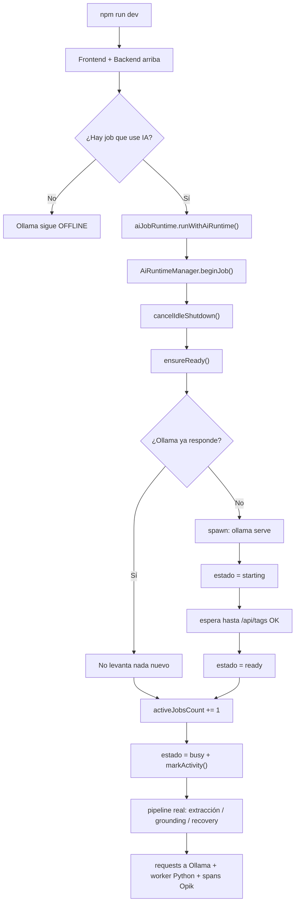
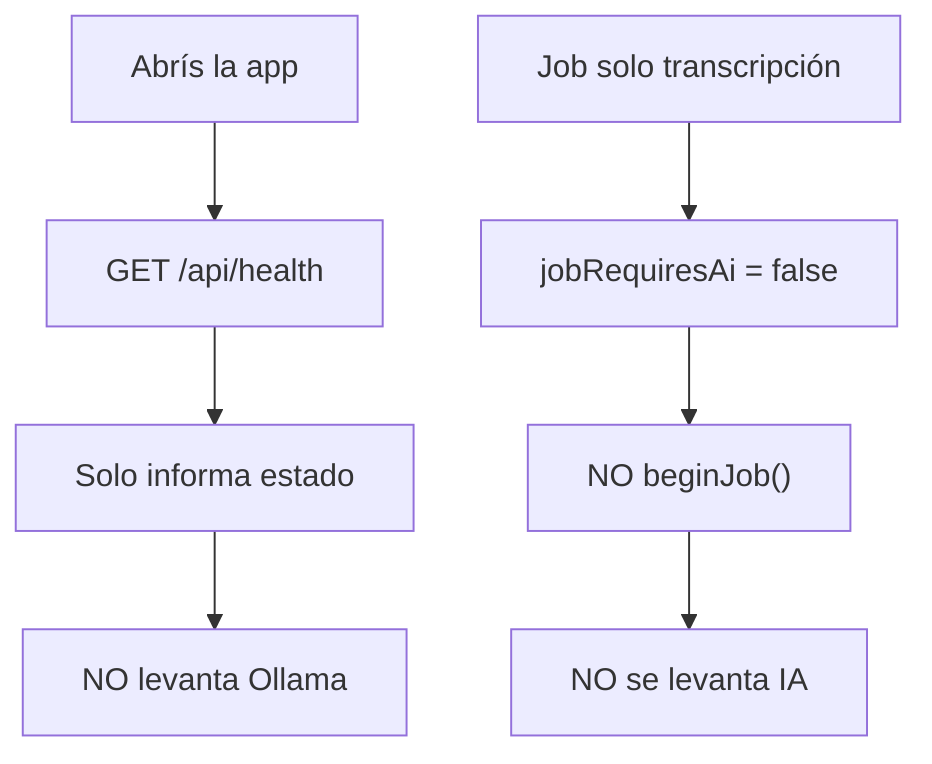
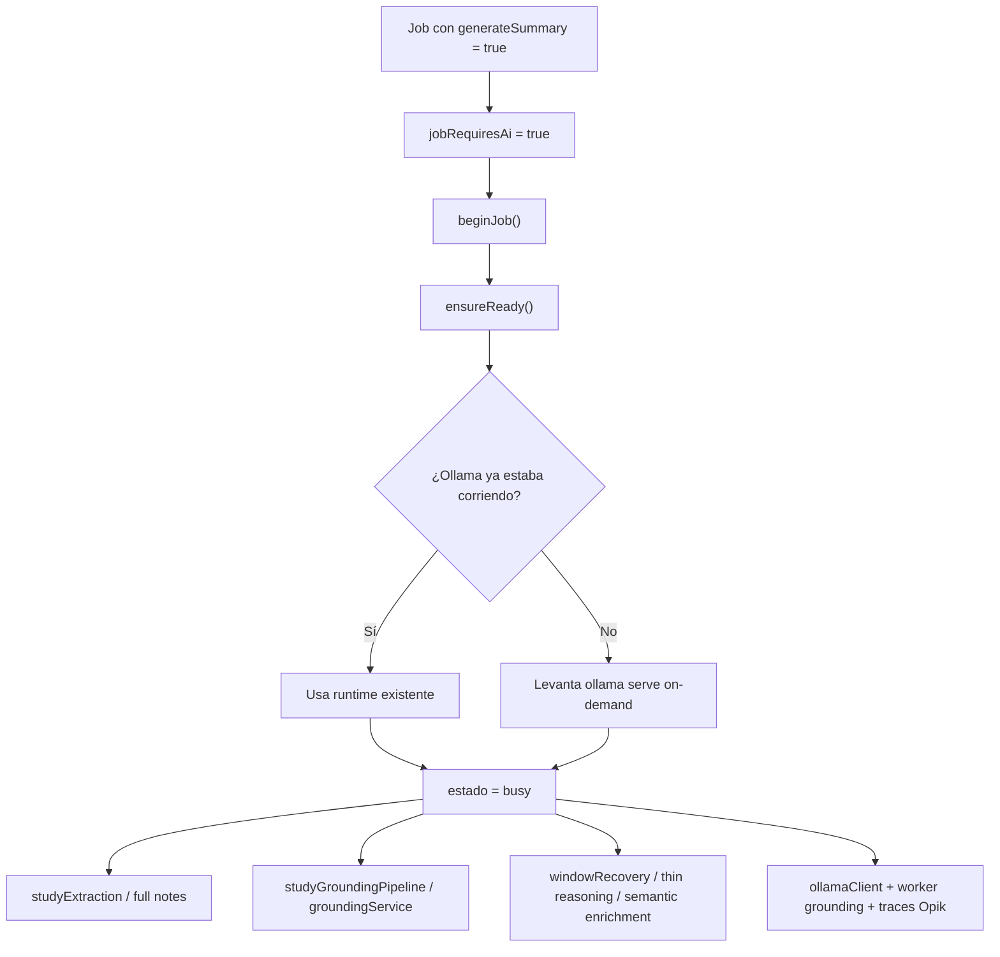
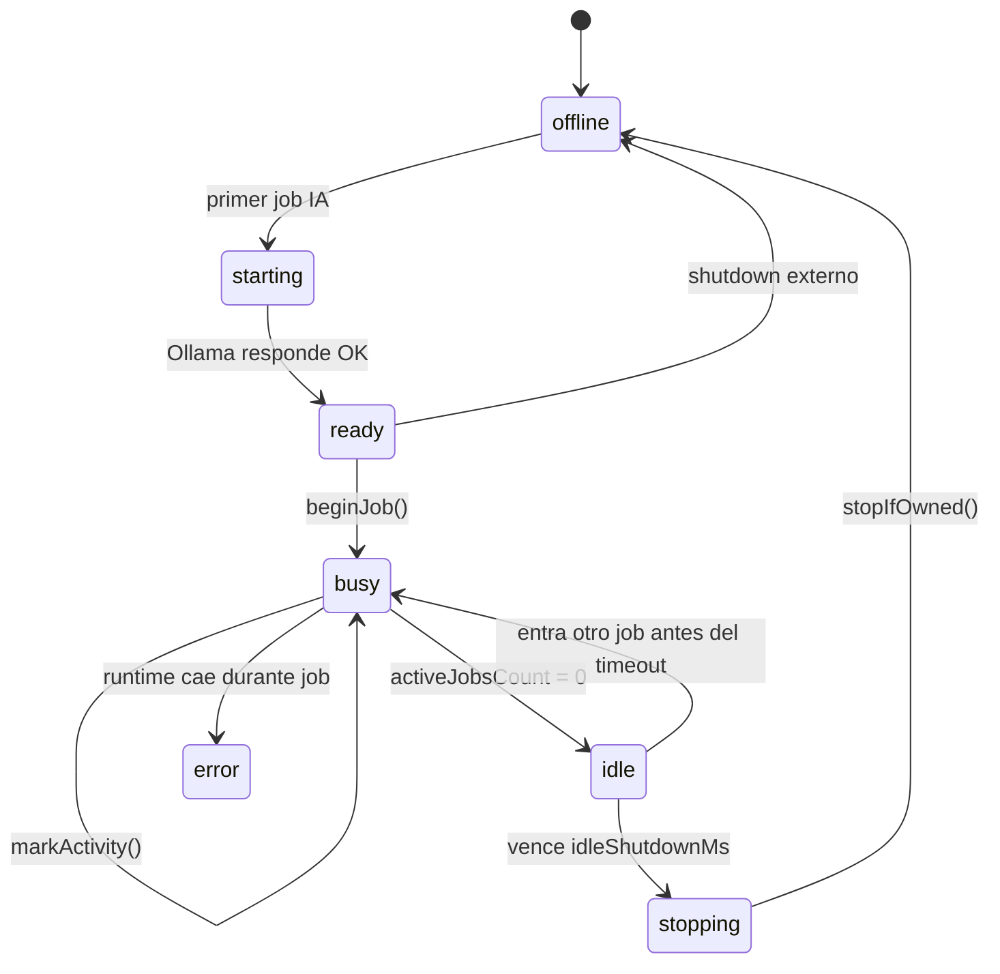
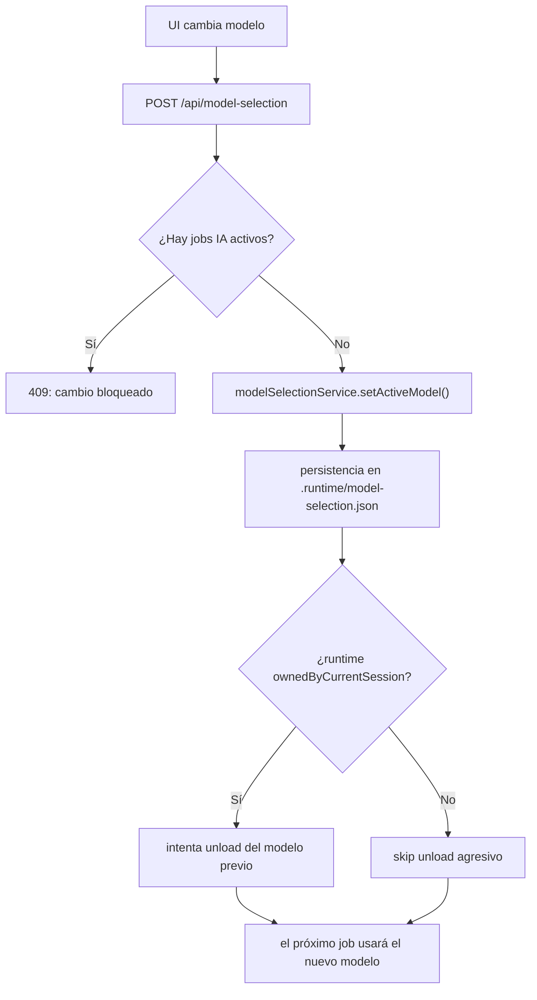
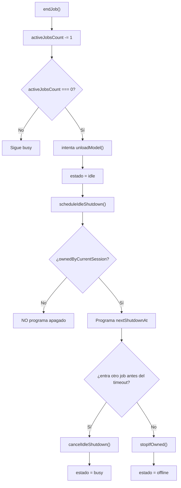
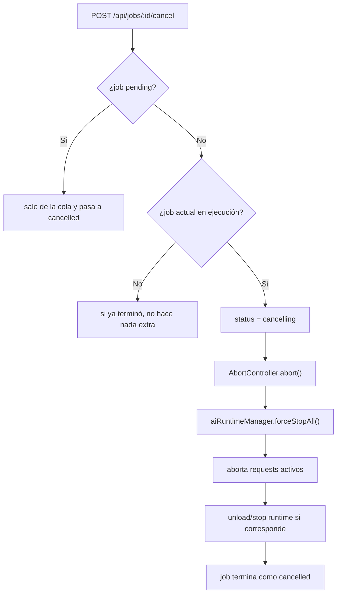
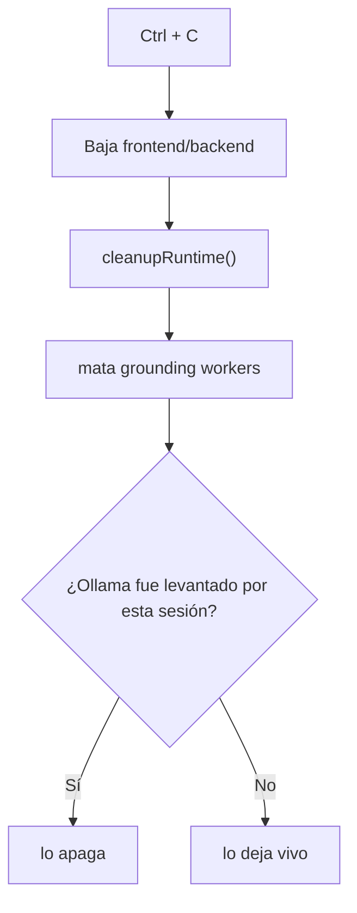

# Runtime de IA: cuándo se levanta y cuándo se apaga

Este documento resume **en qué momento** y **bajo qué circunstancias** se levanta la IA del proyecto, usando la implementación actual basada en:

- `/Users/luis/Desktop/video-summary/backend/src/services/aiRuntimeManager.ts`
- `/Users/luis/Desktop/video-summary/backend/src/services/aiJobRuntime.ts`
- `/Users/luis/Desktop/video-summary/backend/src/services/jobQueue.ts`
- `/Users/luis/Desktop/video-summary/backend/src/services/ollamaClient.ts`
- `/Users/luis/Desktop/video-summary/backend/src/services/groundingService.ts`
- `/Users/luis/Desktop/video-summary/backend/src/services/modelSelectionService.ts`
- `/Users/luis/Desktop/video-summary/backend/src/routes/modelSelection.routes.ts`
- `/Users/luis/Desktop/video-summary/backend/src/services/videoProcessor.ts`
- `/Users/luis/Desktop/video-summary/backend/src/services/opikTracer.ts`

La idea central sigue siendo la misma:

- Ollama **no se levanta al boot**
- el runtime se activa **solo** cuando un job con `generateSummary=true` lo necesita
- el modelo LLM principal activo puede cambiarse desde la UI, pero **solo aplica a jobs futuros**
- al terminar los jobs IA, primero se intenta **descargar el modelo** para liberar RAM y recién después queda `idle`

## 1. Flujo principal

## 2. Cuándo NO se levanta

## 3. Cuándo SÍ se levanta

## 4. Estados del runtime

## 5. Cambio global del modelo activo

Reglas reales actuales:

- la selección es **global**
- afecta **solo jobs futuros**
- el modelo se congela al inicio de cada job en `job.modelMetadata`
- si el modelo persistido desaparece de Ollama, el backend intenta fallback al `OLLAMA_MODEL` del `.env`

## 6. Regla de apagado e unload

Punto fino importante:

- **unload del modelo** y **apagado del servidor Ollama** no son la misma cosa
- primero se intenta liberar RAM descargando el modelo
- el apagado completo del runtime queda como respaldo cuando el idle timeout vence y la sesión es dueña del proceso

## 7. Cancelación de jobs

La cancelación actual es **cooperativa**:

- aborta requests HTTP activos a Ollama
- intenta descargar el modelo y/o apagar el runtime según ownership
- no convierte la cola local en distribuida ni paralela; sigue siendo un executor secuencial

## 8. Regla especial de `Ctrl + C`

## 9. Observabilidad con Opik

El lifecycle del runtime hoy convive con observabilidad explícita:

- `backend/src/index.ts` configura variables base de Opik
- `backend/src/services/opikTracer.ts` crea el cliente
- `backend/src/services/videoProcessor.ts` abre el trace raíz `video.pipeline`
- `backend/src/services/ollamaClient.ts` cuelga spans LLM del trace activo

O sea:

- el runtime define **cuándo** hay IA viva
- Opik te deja ver **qué hizo** esa IA durante download / transcribe / summarize / recovery

## Resumen ejecutivo

- La IA **no se levanta al boot** del proyecto.
- La IA se levanta **solo** cuando arranca un job que requiere resumen/grounding.
- El modelo LLM principal puede cambiarse desde la UI, pero el cambio se persiste y **solo aplica a jobs futuros**.
- Mientras haya jobs IA activos, el runtime queda en `busy`.
- Cuando terminan todos los jobs IA, primero se intenta **unload del modelo** y recién después el runtime pasa a `idle`.
- Si el runtime fue levantado por esta sesión y no entra otro job antes del timeout, se apaga solo para liberar memoria.
- Si cancelás un job en ejecución, el sistema aborta requests activos y fuerza stop/unload del runtime cuando corresponde.
