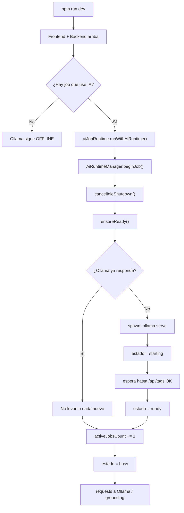
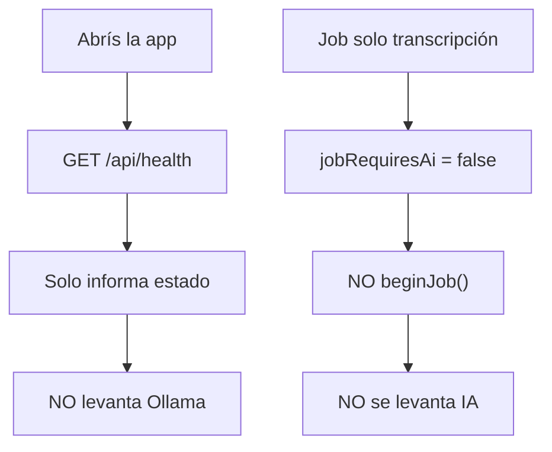
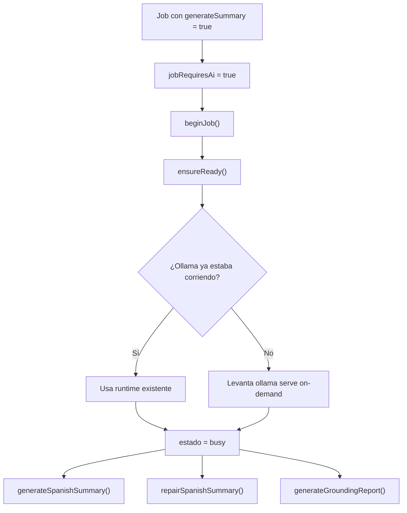
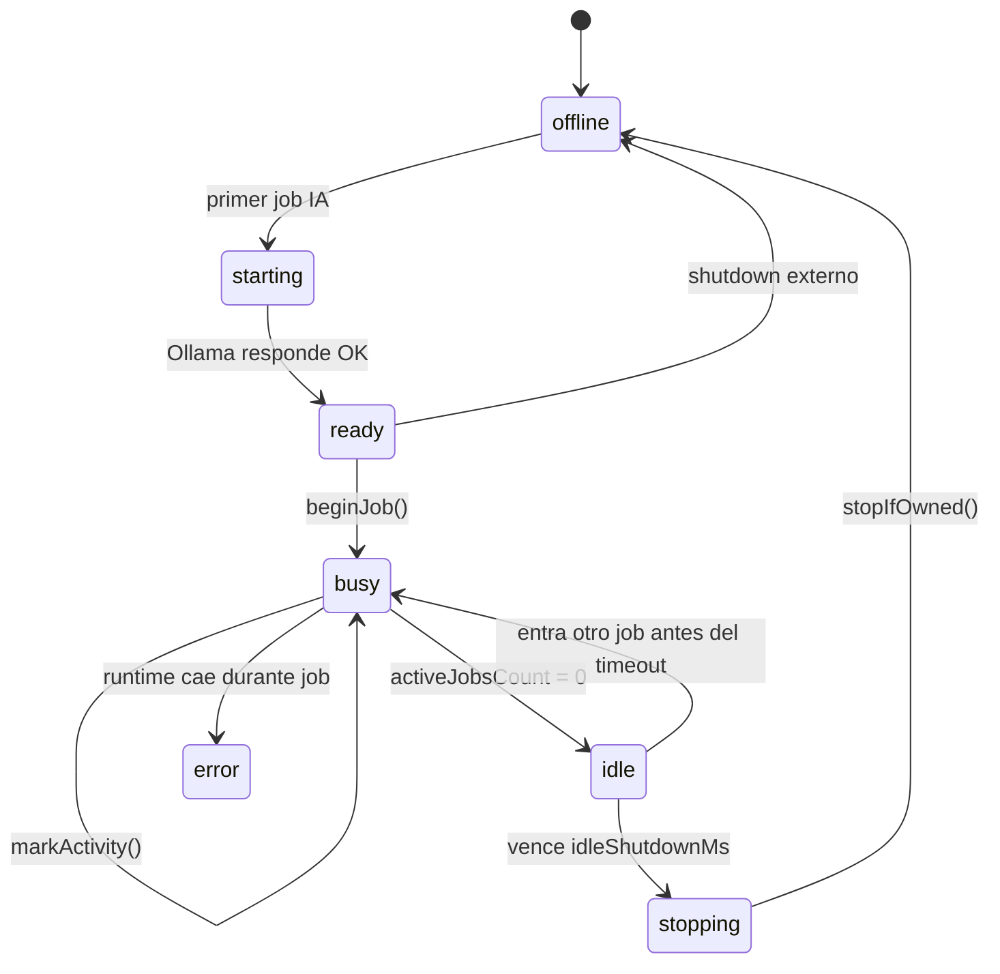
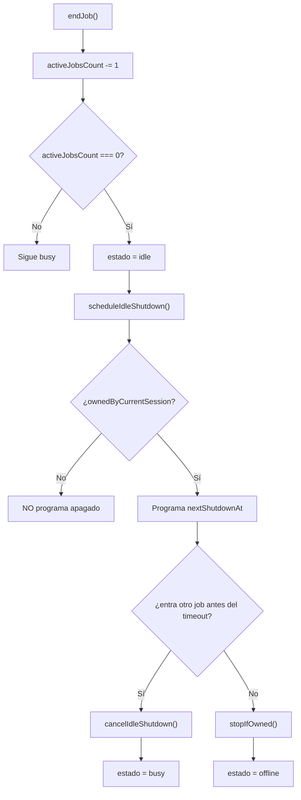
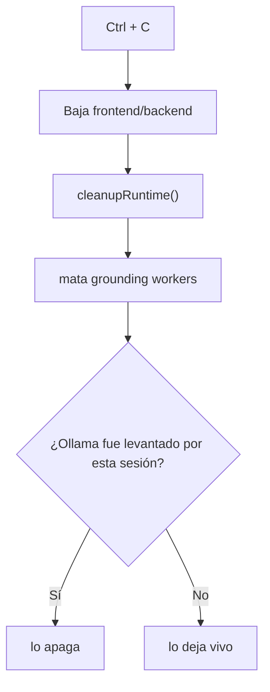

# Runtime de IA: cuándo se levanta y cuándo se apaga

Este documento resume **en qué momento** y **bajo qué circunstancias** se levanta la IA del proyecto, usando la implementación actual basada en:

- `/Users/luis/Desktop/video-summary/backend/src/services/aiRuntimeManager.ts`
- `/Users/luis/Desktop/video-summary/backend/src/services/aiJobRuntime.ts`
- `/Users/luis/Desktop/video-summary/backend/src/services/ollamaClient.ts`
- `/Users/luis/Desktop/video-summary/backend/src/services/groundingService.ts`

## 1. Flujo principal

## 2. Cuándo NO se levanta

## 3. Cuándo SÍ se levanta

## 4. Estados del runtime

## 5. Regla de apagado

## 6. Regla especial de `Ctrl + C`

## Resumen ejecutivo

- La IA **no se levanta al boot** del proyecto.
- La IA se levanta **solo** cuando arranca un job que requiere resumen/grounding.
- Mientras haya jobs IA activos, el runtime queda en `busy`.
- Cuando terminan todos los jobs IA, el runtime pasa a `idle`.
- Si el runtime fue levantado por esta sesión y no entra otro job antes del timeout, se apaga solo para liberar memoria.
